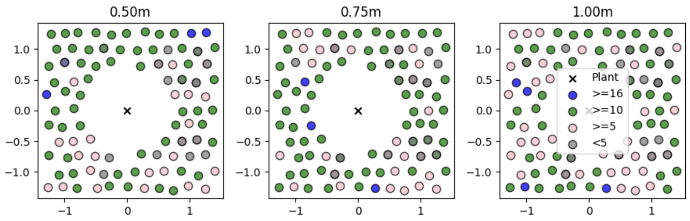
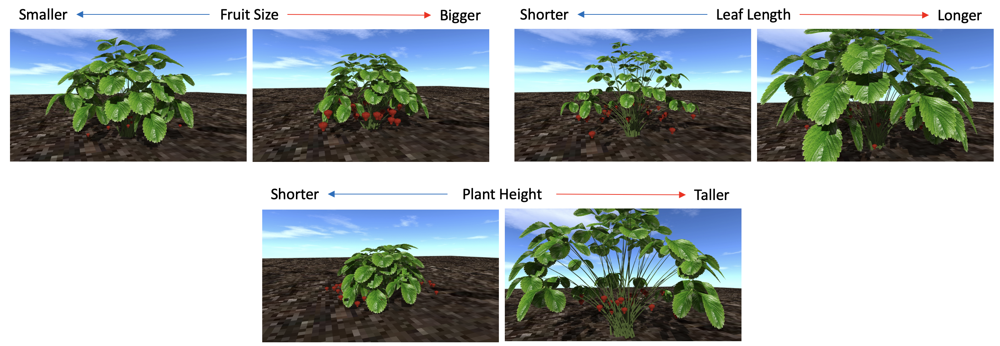
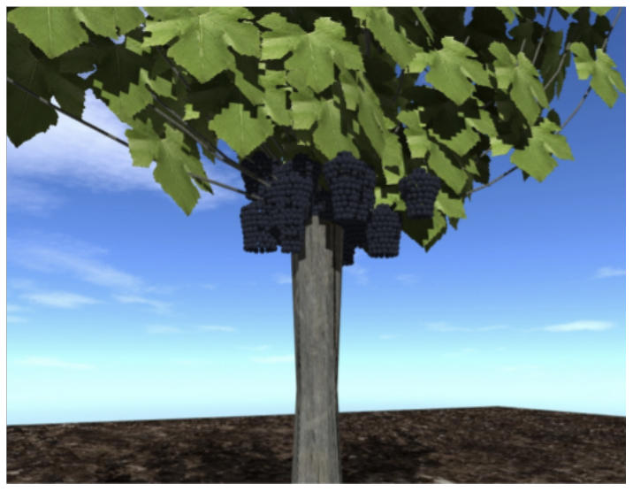
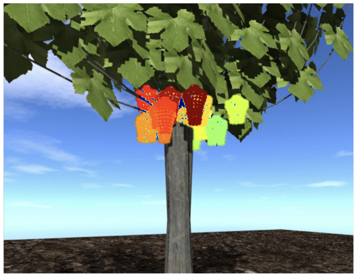
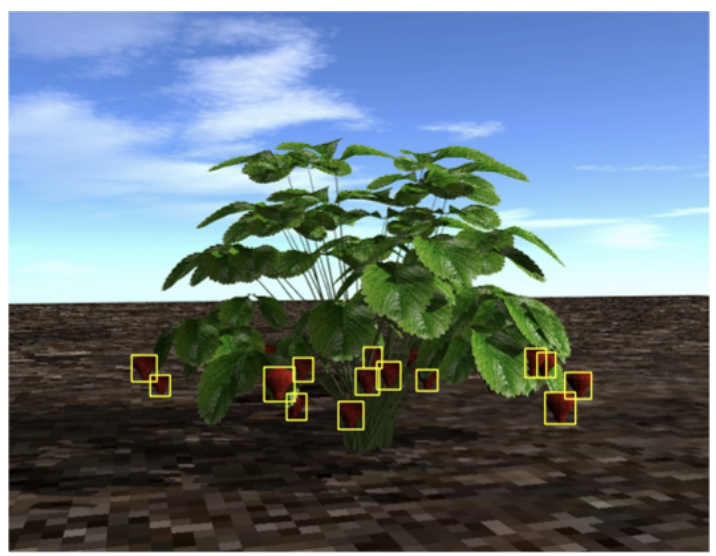
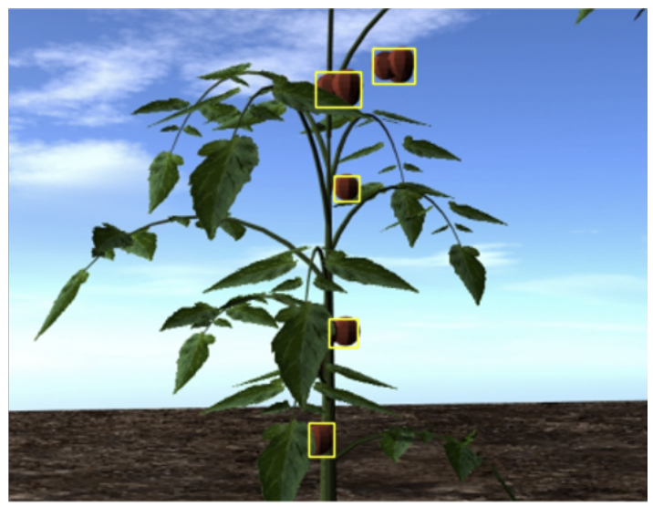
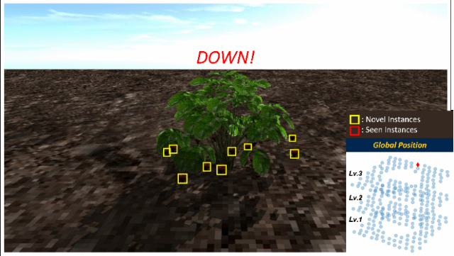

# "DAVIS-Ag" Dataset

This repository is for the official release of the "DAVIS-Ag" dataset, introduced in: 

> *"DAVIS-Ag: A Synthetic Plant Dataset for Developing Domain-Inspired Active Vision in Agricultural Robots"*. Taeyeong Choi, Dario Guevara, Grisha Bandodkar, Zifei Cheng, Chonghan Wang, Brian N. Bailey, Mason Earles, and Xin Liu. [\[arXiv:2303.05764\]](https://arxiv.org/pdf/2303.05764.pdf). 

For research in active vision in Agricultural scenarios, DAVIS-Ag presents >502K RGB images with useful labels from  632 realistically synthesized plant environments. In particular, you can simulate an embodied agent that can move without any complicated components (e.g., gaming engines, ROS, etc.) because viewpoints for imaging were sampled from densely distributed locations while each viewpoint is also linked with others if *reachable* by an execution of action. 

Pixel-wise segmentations and bounding boxes of fruits are available with unique "instance" ID's for studies on instance-level fruit detection/coverage. Global poses of cameras are also provided for development of vision-based navigation/localization. More details are described below. 

## Table of Contents: 
- ["DAVIS-Ag" Dataset](#davis-ag-dataset)
  - [Table of Contents:](#table-of-contents)
- [Download](#download)
- [Directory Structure](#directory-structure)
- [Scene Configurations](#scene-configurations)
    - [Spatial Sampling Method](#spatial-sampling-method)
    - [Random Variations in Phenotypes](#random-variations-in-phenotypes)
- [Labels \& File Format](#labels--file-format)
    - [Annotations.json](#annotationsjson)
- [Generation Pipeline](#generation-pipeline)
- [Use-case Example](#use-case-example)
- [Supplementary Video](#supplementary-video)
- [Contact](#contact)


# Download

- Single-Strawberry: [[PART1]](https://drive.google.com/file/d/16F10E4fybkzuII2NeRtkyogfJtVV4zoC/view?usp=share_link) |  [[PART2]](https://drive.google.com/file/d/1nyH1-gJZbCWlYG8Pijt0UMayQOGSIw0V/view?usp=share_link) | [[Splits]](https://drive.google.com/file/d/1-9ZENdmVi6CuhjP9gOXw-KZ1hV5PAKVC/view?usp=share_link)
- Single-Tomato: Coming very soon!
- Single-Vine: Coming very soon!
- Multi-Strawberry: Coming very soon!
- Multi-Tomato: Coming very soon!
- Multi-Vine: Coming very soon!


# Directory Structure

Once you have downloaded DAVIS-Ag, you could find its structure of directory as below: 
```
"Scenario-Plant_Type"
 └── "Scene_#" 
     ├── "annotations.json"  
     └── "images" 
           ├── "Image_#.jpeg"
           └── "Image_#_seg.png"
```

For example, under `Single-Tomato`, you could see: 

```
Single-Tomato
 ├── 000 
 ├── 001 
 ├── 002 
     ├── annotations.json 
     └── images 
          ├── 0001.jpeg
          ├── 0001_seg.png
          ├── 0002.jpeg
          ├── 0002_seg.png
           ...
          ├── 0347.jpeg
          └── 0347_seg.png 
 ...
 ├── 135 
 └── 136  
```

Each `*.jpeg` is a RGB image with the resolution of 1280x720 which was taken from a particular viewpoint. Similarly, `*_seg.png` is a image file of the same size that shows the corresponding pixel-wise segmentation of fruits. 
`annotations.json` contains all other useful labels, explained [Labels & File Format](#labels--file-format) section below.


# Scene Configurations   

Three types of plant are simulated: `Strawberry`, `Tomato`, and `Goblet Vine`, and for each type, two different scenarios are considered depending on the size of the scene. 

- *Single-plant (SP)*: One single plant is positioned at the central location of the scene; Camera views from any positions are designed to always aim at the plant; Three different altitudes of view are simulated; Six actions are considered: *Forward, Backward, Left, Right, Up*, and *Down*.

- *Multi-plant (MP)*: Three plants in a row are present in each tomato or vine scene while five in a row in a strawberry scene; Two levels of height of view are simulated; Eight actions are executable: *Forward, Backward, Left, Right, Up, Down, Rotate_Clockwise,* and *Rotate_Counterclockwise*.

In total, 502,542 RGB images and associated labels are available. More specific stats for both scenarios are shown in the tables below.

| SP  | Total | Strawberry  |  Tomato | Goblet Vine | 
|:-:|---|---|---|:-:|
| # of Scenes  | 398 | 86  | 130  | 182  |
| # of RGB Images  | 133,086  | 24,510  | 45,240  | 63,336  | 

| MP  | Total | Strawberry  |  Tomato | Goblet Vine | 
|:-:|---|---|---|:-:|
| # of Scenes  | 234 | 77  | 113  | 44  |
| # of RGB Images  | 369,456  | 86,856  | 203,400  | 79,200  | 


### Spatial Sampling Method

For simulation of mobile agent, a number of viewpoints are sampled from a dense spatial distribution in each scene. For example, as seen below, each `Single-Strawberry` scenario features 285 viewpoints (i.e., colorful circles) pre-selected around a plant (i.e., "x" at the center) across a three dimensional space, where the grid is 3m wide and 3m long, and three levels of altitudes–i.e., 0.50m, 0.75m, and 1.00m–are simulated. Those viewpoints were determined by a simulated step size of 25cm.



Moreover, each position is perturbed by an additive white Gaussian noise $\epsilon \sim N(0, 2.5cm)$ to consider a possible "slip" of robot in the outdoor environment.
For more information on the cases with MP scenarios or other types of plant, read Section III [in the cited paper above](#davis-ag-dataset).

### Random Variations in Phenotypes

Each scene was produced with randomized parameters to show distinct phenotypic characteristics from others. 
To be specific, initial parameters for the sizes of fruit, leaf, and trunk were each randomly sampled from $U(0.8\alpha, 1.2\alpha)$, where $\alpha$ represents the default setting in <a href="https://baileylab.ucdavis.edu/software/helios/" target="_blank">Helios</a>. Several examples with unique appearances in Single-Strawberry scenes are displayed below. 



# Labels & File Format

Each RGB image (`*.jpeg`) is provided with the following labels: 

1. Pixel-wise instance segmentation of fruits (`*._seg.png`)

2. Bounding boxes of fruits

3. Global pose of viewpoint

4. Action pointers

where 2–4 are all provided in `annotations.json`. In particular, DAVIS-Ag offers 1 and 2 with unique "instance" ID's of fruits in the scene. For instance, each pixel in `*_seg.png` can represent a unique instance ID of fruit in the scene. Pixels that are not of any fruit are set to 255. 

 | RGB of Goblet Vine | Segmentation of Goblet Vine |
|:-:|:-:|
|| |

| Bounding Boxes of Strawberries  | Bounding Boxes of Tomatoes  |
|:-:|:-:|
|| |

### Annotations.json

Inspired by <a href="https://www.cs.unc.edu/~ammirato/active_vision_dataset_website/index.html" target="_blank">Active Vision Dataset</a>, `annotations.json` is designed to present the information of bounding boxes and other labels:

```
{
    "image_name":{
      "bounding_boxes":[
          [xmin ymin width height instance_id 0],
          [xmin ymin width height instance_id 0],
          ...,
      ],
      "pose": [x, y, z, yaw, pitch],
      // action pointers below
      "forward":"another_image_name",
      "backward":"another_image_name",
      "left":"another_image_name",
      "right":"another_image_name",
      "up":"another_image_name",
      "down":"another_image_name",
      "rotate_ccw":"another_image_name",
      "rotate_cw":"another_image_name"

  },
  "next_image_name":{ ...
  
}
```

Forth entry (`instance_id`) in a bounding box can be used to track a particular instance of fruit, which matches that in segmentation. Also, `pose` represents the pose of camera that was used to take the image in the global coordinate system. 

Furthermore, each possible action is *linked* with another image file to simulate the action of embodied agent. You can simply use *a line of code* to simulate the mobility of agent as follows: 

```
next_image_name = annotation_json[image_name][action]
```

By taking a chain of actions in a loop, a simulated agent can explore the scene as below:


If the chosen action leads to a position out of the grid or too close to a plant, "" is given. For more details of such constraints, refer to Section III-C of [the cited paper above](#davis-ag-dataset).  


# Generation Pipeline 

Two major software components have been fully utilized to produce DAVIS-Ag: 

1. <a href="https://baileylab.ucdavis.edu/software/helios/" target="_blank">Helios</a>
2.  <a href="https://github.com/Project-AgML/AgML" target="_blank">AgML</a>

which are both actively developed by research groups based in the University of California, Davis. 

More specifically, several plugins in Helios were used to synthesize realistic visual data of plant with annotations whereas AgML worked as an interface for Python scripts to freely access those plugins for particular purposes of DAVIS-Ag. 

For those who are interested in more technical details, reading Section III-A of [the cited paper above](#davis-ag-dataset) is strongly recommended.


# Use-case Example 

To be updated very soon to provide the Python codes used for the Experiments section in [the paper above](#davis-ag-dataset).


# Supplementary Video

https://youtu.be/CIXA1qgl6JM 


# Contact

If you have any questions, please feel free to send an email to: taechoi@ucdavis.edu.
